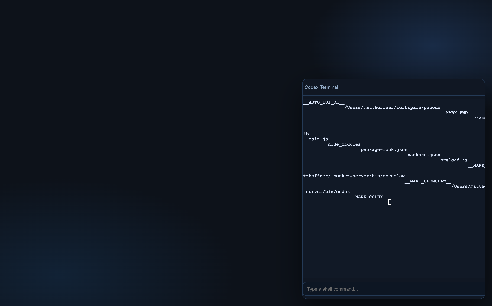

# pixelbox

Pixelbox is a local AI software workspace: one app where you can switch projects, run agent terminals, and view the running app in-place.



## Vision

Pixelbox should feel like an AI-native operating surface for software creation:

- Multiple long-running agent sessions, scoped by project.
- Fast switching between projects without losing runtime/session context.
- A full app viewport for what is currently running.
- Tight loop between editing, running, observing logs, and iterating.
- Explicit coordination between "editor" and "runtime" lanes.

## Roadmap

1. **Session Model**
   - Persistent per-project Codex/OpenClaw sessions across app restarts.
   - Stronger session resume and recovery behavior.
2. **Guided Startup Flows**
   - "Nothing live yet" quick actions:
     - Boot Next.js service
     - Create static HTML page
     - Create static Next.js page
     - Surprise me
3. **Agent Coordination**
   - Built-in two-lane workflow (editor/runtime) with shared handoff state.
   - Better project-scoped prompts/skills.
4. **Runtime Controls**
   - Cleaner server lifecycle controls and health status.
   - Better log surfaces and failure diagnostics.
5. **Validation**
   - Expand Playwright smoke tests for project switching + runtime visibility.
   - Add deterministic e2e checks for session persistence.

## Features (Current)

- Floating terminal panel with xterm.
- Project switcher and per-project runtime config.
- Embedded live app view for local URLs/files.
- Per-project terminal/session continuity behavior.
- Local guidance injection (`AGENTS.md`) and handoff scaffolding (`.pixelbox/handoff.md`).

## How To Use

### 1. Start Pixelbox

```bash
npm install
npm run dev
```

### 2. Pick or create a project

- Use the overlay menu to select an existing project.
- Or click `New Project` to create one.

### 3. Configure how the project should render

In **Running Page**:

- `Source: Node/server command` for frameworks (Next.js/Vite/etc).
- Set `Server command` (example: `npm run dev`).
- Set `Server URL` (example: `http://localhost:3000`) if needed.
- Click `Save`, then `Start`.

Or:

- `Source: HTML file` and point to a static file.

### 4. Work with agents in terminal

- Open the terminal panel.
- Use project-scoped prompts.
- Keep runtime and editor tasks coordinated via `.pixelbox/handoff.md`.

## Suggested Prompt (for "Nothing live yet")

Use this prompt in terminal when a project is empty:

```text
You are inside Pixelbox. Create a minimal landing page for this project and make it visible in the app.
If this project has no framework, create static HTML/CSS in a simple structure.
If scripts are needed, ensure npm run dev works non-interactively.
When done, print:
1) changed files
2) exact command to run
3) local URL
```

## Tests

```bash
# Core test suite
npm test

# Playwright Electron tests
npm run test:pw
npm run test:pw:run

# Codex/OpenClaw targeted flows
npm run test:pw:codex
npm run test:pw:openclaw
npm run test:pw:next
```

## Architecture

- `main.js`: Electron main process, IPC, terminal/runtime managers.
- `preload.js`: renderer-safe API bridge.
- `renderer/`: UI shell, terminal wiring, runtime controls.
- `lib/terminalSession.js`: PTY/stdin shell session wrapper.
- `lib/terminalManager.js`: multi-session terminal lifecycle by project.
- `lib/previewRuntimeManager.js`: project runtime process supervision + URL detection.
