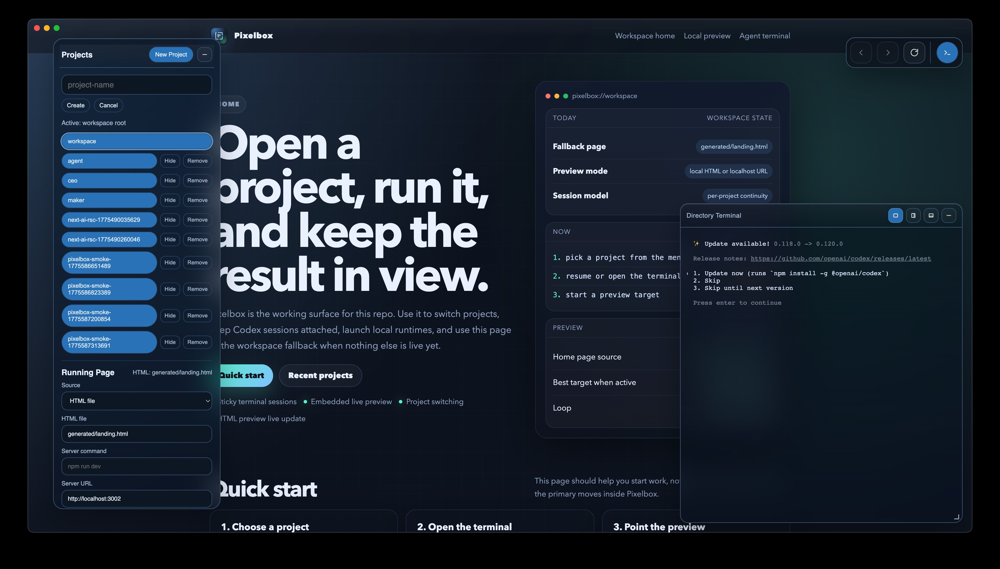

# pixelbox

Pixelbox is a local AI software workspace: one app where you can switch projects, run agent terminals, and view the running app in-place.


## Vision

Pixelbox should feel like an AI-native operating surface for software creation:

- Multiple long-running agent sessions, scoped by project.
- Fast switching between projects without losing runtime/session context.
- A full app viewport for what is currently running.
- Tight loop between editing, running, observing logs, and iterating.
- Explicit coordination between "editor" and "runtime" lanes.

## Roadmap

1. **Session Model**
   - Persistent per-project Codex/OpenClaw sessions across app restarts.
   - Stronger session resume and recovery behavior.
2. **Guided Startup Flows**
   - "Nothing live yet" quick actions:
     - Boot Next.js service
     - Create static HTML page
     - Create static Next.js page
     - Surprise me
3. **Agent Coordination**
   - Built-in two-lane workflow (editor/runtime) with shared handoff state.
   - Better project-scoped prompts/skills.
   - Approved for independent implementation: [Working Agreements](docs/working-agreements.md), an evidence-bound and reversible way to trial a repeated project correction before a person promotes it into project guidance. This remains a product contract, not a released feature or public capability; its proof and release gates still apply.
4. **Runtime Controls**
   - Cleaner server lifecycle controls and health status.
   - Better log surfaces and failure diagnostics.
5. **Validation**
   - Expand Playwright smoke tests for project switching + runtime visibility.
   - Add deterministic e2e checks for session persistence.
6. **Visual Iteration**
   - First-class screenshot capture of the live Pixelbox window during hot-reload loops.

## Features (Current)

- Floating native Ghostty terminal panel.
- Project switcher and per-project runtime config.
- Embedded live app view for local URLs/files.
- Server preview Start/Restart controls that relaunch the managed process and reload the live preview after code edits.
- Pixelbox Reentry states (`Building`, `Needs you`, `Blocked`, `Proving`, `Ready`, and `Proof stale`) backed by project-scoped workspace fingerprints, current runtime context, Live Check evidence, and SHA-256-checked snapshots.
- Live run proof receipts with one-click Verify, Markdown Proof Packs, Verified Run ledger events, automatic Live Check probes, Runtime Output tails in Ship Briefs, Proof Snapshot PNGs, Snapshot Compare, project, command, URL, inspectable touched files, copyable verification text, and one-click Ship Brief handoffs.
- Isolated capability URLs for static previews and evidence, plus strict loopback Host/Origin/method checks, bounded bridge requests, and symlink-aware workspace containment.
- Native app runtime support with capture-image previews.
- AI Launch presets for Codex, Claude, Gemini, Hermes, OpenClaw TUI, or a plain terminal.
- In-app agent monitor for active Codex processes.
- Hidden-project restore list and cleaner project action menus.
- Local screenshot skill for capturing the current Pixelbox window during UI iteration.
- Keyboard project switching with `Cmd/Ctrl+Shift+ArrowLeft` and `Cmd/Ctrl+Shift+ArrowRight`.
- File-path drag and drop into the terminal.
- Automatic local port reassignment for colliding localhost dev servers.
- Per-project terminal/session continuity behavior.
- Local guidance injection (`AGENTS.md`) and handoff scaffolding (`.pixelbox/handoff.md`).

## Landing Site

Pixelbox now includes a standalone static landing site in [`landing/`](landing).

- Intended deployment target: Vercel
- Recommended Vercel root directory: `landing`
- Local preview:

```bash
cd landing
python3 -m http.server 4173
```

- Local URL:

```text
http://127.0.0.1:4173
```

## How To Use

### 1. Start Pixelbox

```bash
npm install
npm run dev
```

### 2. Pick or create a project

- Use the overlay menu to select an existing project.
- Or click `New Project` to create one.

### 3. Let Preview Agent run the project

Preview Agent detects an npm `dev`/`start` script or a static entry such as `index.html`, starts it, health-checks it, and recovers managed servers. Use **Advanced settings** when detection needs help:

- Choose `Dev server` for frameworks such as Next.js or Vite, then set the start command and optional expected URL.
- Choose `Static site` and point to the entry HTML file.
- Choose `Native app` and provide its run, capture, and image settings.
- Use **Start/Restart** to resume automatic management or **Pause** to stop recovery.

Use **Verify** in Reentry to bind the current Live Check and snapshot to the selected project's workspace fingerprint. Any later relevant file or preview-context change becomes **Proof stale**; Pixelbox's own `.pixelbox` and `.pxcode` proof writes do not invalidate the receipt.

### 4. Work with agents in terminal

- Open the terminal panel.
- In **AI Launch**, choose which agent CLI should auto-start for the selected project, or choose `Plain terminal` to open the shell without launching one.
- Use **Agent Monitor** to inspect active Codex processes running on the machine.
- Use project-scoped prompts.
- Keep runtime and editor tasks coordinated via `.pixelbox/handoff.md`.

### 5. Capture the current Pixelbox window

When a project is already hot reloading inside Pixelbox, capture the real current
window instead of guessing from code:

```bash
bash scripts/capture-current-window.sh screenshots/current-window.png Pixelbox
```

To capture only the embedded preview region, keep Pixelbox frontmost and pass
`preview` as the capture scope:

```bash
bash scripts/capture-current-window.sh screenshots/current-preview.png Pixelbox preview
```

This writes:

- `screenshots/current-window.png`
- `screenshots/current-window.json`

For visual polish work, use the local `pixelbox-window-screenshot` skill as a
loop: capture a baseline, inspect the real rendered image, make one focused
change, wait for hot reload, then capture `screenshots/visual-loop-01.png`,
`visual-loop-02.png`, and so on until the screenshot matches the target.

Use the local `pixelbox-video-review` skill after Playwright or visual-loop runs
to inspect the recorded video, extract representative frames, and answer whether
the recording actually proves the workflow worked.

## Suggested Prompt (for "Nothing live yet")

Use this prompt in terminal when a project is empty:

```text
You are inside Pixelbox. Create a minimal landing page for this project and make it visible in the app.
If this project has no framework, create static HTML/CSS in a simple structure.
If scripts are needed, ensure npm run dev works non-interactively.
When done, print:
1) changed files
2) exact command to run
3) local URL
```

## Tests

```bash
# Core test suite
npm test

# Reentry browser acceptance: isolated preview -> Ready -> real edit -> Proof stale
node test/pw_reentry_smoke.js

# Native shell build, including custom-port health probing
zig build

# Playwright desktop tests
npm run test:pw
npm run test:pw:run
npm run test:pw:visual-loop
npm run test:pw:visual-loop:codex

# Codex/OpenClaw targeted flows
npm run test:pw:codex
npm run test:pw:openclaw
npm run test:pw:next
```

## Architecture

- `build.zig`: Zero Native app build, Ghostty linkage, packaging, and platform wiring.
- `src/main.zig`: application entry point and manifest/runtime boot.
- `src/runner.zig`: desktop orchestration for windows, bridge events, and runtime actions.
- `bridge/server.js`: local workspace bridge for project state, runtimes, and PTY-backed sessions.
- `renderer/`: UI shell, terminal panel integration, and runtime controls.
- `lib/codexMonitor.js`: active Codex process discovery + transcript summarization helpers.
- `lib/terminalSession.js`: PTY/stdin shell session wrapper.
- `lib/terminalManager.js`: multi-session terminal lifecycle by project.
- `lib/previewRuntimeManager.js`: project runtime process supervision + URL detection.
- `lib/projectFingerprint.js`: scoped Git/filesystem fingerprints and actual changed/evidence file sets.
- `lib/previewAccess.js`: expiring localhost capability URLs that isolate static previews and proof artifacts from bridge authority.
- `renderer/proof-reentry.js`: fail-closed Reentry verification schema and state derivation.

The loopback bridge is protected from hostile browser origins and untrusted static previews, but it is not an authentication boundary against another process running as the same OS user. Agent hooks, approval controls, or remote intervention need a per-launch secret and narrower endpoint capabilities before they are added.
